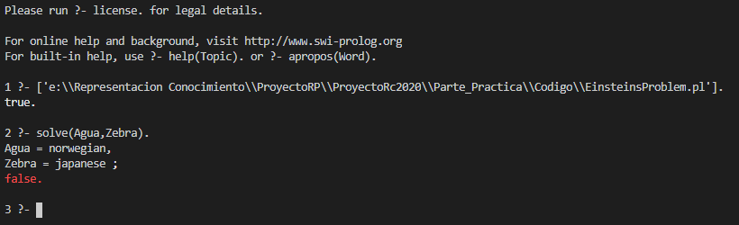
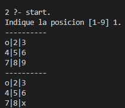

# Acertijo de Einstein y Tres en Raya <!-- omit in toc -->

[🏫 Universidad de Huelva (UHU)](http://www.uhu.es/index.php)  
📅 Curso 2019-2020  
📚 [Representación del Conocimiento](http://www.uhu.es/etsi/informacion-academica/informacion-comun-todos-los-titulos/guias-docentes/guias-docentes-2019-2020/listado-guias/guia_1920/?codigo=606010236) 

Equipo:
- 👨‍🎓 [Alejandro Bueno Mañas](https://github.com/alexbm98)
- 👨‍🎓 [José Rramón López Garrido](https://github.com/Joseram0n)

___

## Índice <!-- omit in toc -->

- [1. INTRODUCCIÓN](#1-introducción)
- [2. EINSTEIN’S RIDDLE](#2-einsteins-riddle)
  - [2.1. BREVE DESCRIPCIÓN DEL PROBLEMA](#21-breve-descripción-del-problema)
  - [2.2. CÓDIGO PROPUESTO QUE RESUELVE EL PROBLEMA](#22-código-propuesto-que-resuelve-el-problema)
  - [2.3. EJEMPLO DE FUNCIONAMIENTO](#23-ejemplo-de-funcionamiento)
- [3. TRES EN RAYA](#3-tres-en-raya)
  - [3.1. INTRODUCCIÓN AL JUEGO](#31-introducción-al-juego)
  - [3.2. OBJETIVO](#32-objetivo)
  - [3.3. ANÁLISIS DEL CÓDIGO](#33-análisis-del-código)
    - [3.4.1. DEFINICIÓN DE PREDICADOS](#341-definición-de-predicados)
    - [3.4.2. MEJORAS IMPLEMENTADAS](#342-mejoras-implementadas)
      - [3.4.3.1. Mejora Visualización](#3431-mejora-visualización)
      - [3.4.3.2. Mejora tratamiento de errores](#3432-mejora-tratamiento-de-errores)
- [4. REFERENCIAS](#4-referencias)


## 1. INTRODUCCIÓN

En este documento se analizarán los dos problemas que hemos escogido, el problema
“Einstein’s Riddle” (el acertijo de Einstein, también conocido como el acertijo de la cebra) y
el juego del tres en raya (o también conocido como “Tateti” en Argentina, Paraguay y
Uruguay).

Trataremos de explicar lo más claramente posible el código propuesto para cada problema,
de tal manera que sea entendible para la gran mayoría de usuarios.

## 2. EINSTEIN’S RIDDLE

### 2.1. BREVE DESCRIPCIÓN DEL PROBLEMA

El planteamiento es relativamente sencillo: en una calle hay cinco casas de colores distintos,
y en cada casa vive una persona de distinta nacionalidad. Los cinco dueños no tienen
precisamente muchas cosas en común: beben diversos tipos de bebida, fuman diferentes
marcas de cigarrillos, y cada uno tiene una mascota distinta a la de los demás. Dicho esto, se
tienen las siguientes pistas:

**1.** Hay cinco casas.  
**2.** El inglés vive en la casa roja.  
**3.** El español tiene un perro.  
**4.** Se bebe café en la casa verde.  
**5.** El ucraniano bebe té.  
**6.** La casa verde está inmediatamente a la derecha de la casa de color marfil.  
**7.** El fumador de Old Gold tiene caracoles.  
**8.** La marca Kools se fuma en la casa amarilla.  
**9.** Se bebe leche en la casa del centro.  
**10.** El noruego vive en la primera casa.  
**11.** El hombre que fuma Chesterfields vive al lado del hombre con un zorro.  
**12.** La marca Kools se fuma en la casa próxima a la de donde hay un caballo.  
**13.** El fumador de Lucky Strike bebe zumo de naranja.  
**14.** El japones fuma Parliaments.  
**15.** El noruego vive al lado de la casa azul.  


Con estas pistas, se plantean las siguientes preguntas:

- ¿Quién bebe agua?
- ¿Quién es el dueño de la cebra?

Las respuestas a estas dos preguntas son: Noruego y Japonés. Se pueden averiguar a través
del código que proponemos a continuación.

### 2.2. CÓDIGO PROPUESTO QUE RESUELVE EL PROBLEMA

El código que se ha propuesto para resolver esas dos cuestiones se encuentra en el
siguiente enlace:

[Enlace Archivo](https://github.com/Joseram0n/ProyectoRc2020/blob/master/Parte_Practica/Codigo/EinsteinsProblem.pl)

Una vez observado el código, pasemos a analizar los predicados más relevantes:

## nextto (?A, ?B, ?List) <!-- omit in toc -->


Es verdadero cuando los elementos “A” y “B” son consecutivos, en ese orden, en la lista
“List”.

En nuestro código lo empleamos para especificar la regla 6 , de la siguiente forma:

```Prolog
nextto(house(ivory, _, _, _, _), house(green, _, _, _, _),Houses)
``` 

Con esto, estaríamos especificando que la casa verde está justo a continuación de la casa de
marfil, en la lista especificada (más adelante veremos para qué utilizaremos esta lista).

## adjacent (?A, ?B, ?List) :- nextto (A, B, List); nextto (B, A, List) <!-- omit in toc -->


Se ha creado para que el predicado sea verdadero si los elementos “ **A** ” y “ **B** ” son
consecutivos en la lista “ **List** ”, sin importar el orden en el que estén.

Más concretamente, se ha utilizado para especificar las reglas 11, 12 y 15, de la siguiente
manera:

```Prolog
adjacent(house(_, _, _, _, chesterfields), house(_, _, fox, _, _), Houses)

adjacent(house(_, _, _, _, kools), house(_, _, horse, _, _), Houses)

adjacent(house(_, norwegian, _, _, _), house(blue, _, _, _, _), Houses)
```

## solve (-WaterDrinker, -ZebraOwner)<!-- omit in toc -->

Este será el predicado que nos resolverá las dos cuestiones planteadas.

**WaterDrinker** nos indicará la nacionalidad de la persona que bebe agua, por otra parte
**ZebraOwner** nos indicará la nacionalidad de la persona que tiene una cebra como
mascota.

## length (?List, ?Int) <!-- omit in toc -->

Unifica si el número entero “ **Int** ” coincide con el tamaño de la lista “ **List** ”. Se trata de un
predicado reversible ya que podemos averiguar tanto la longitud de una lista como crear
una lista con la longitud del parámetro “ **Int** ”.

En nuestro problema, lo utilizamos en este segundo caso, para crear una lista llamada
“Houses” (la que mencionamos anteriormente) de tamaño 5.

```Prolog
length(Houses,5)
```

Esto se corresponde con la primera pista que detallamos en la descripción del problema,
esta es, que hay cinco casas.

## member(?Elem, ?List) <!-- omit in toc -->

Este predicado será cierto si el elemento “ **Elem** ” existe en la lista “ **List** ”.

En nuestro problema, dicho a grandes rasgos, lo usamos para añadir una estructura
representada por el predicado “house” a la lista Houses que creamos previamente.

El predicado house está modelado de la siguiente manera:

> **house**(Color de la casa, Nacionalidad, Mascota, Bebida, Marca de cigarrillos)

Dicho lo cual, el uso del predicado **_member_** en nuestro código es el siguiente:

```Prolog
member(house(red, english, _, _, _), Houses)

member(house(_, spanish, dog, _, _), Houses)

member(house(green, _, _, coffee, _), Houses)

member(house(_, ukrainian, _, tea, _), Houses)

member(house(_, _, snail, _, old_gold), Houses)

member(house(yellow, _, _, _, kools), Houses)

member(house(_, _, _, orange_juice, lucky_strike), Houses)

member(house(_, japanese, _, _, parliaments), Houses)

%-------------------------------------------------------%

member(house(_, WaterDrinker, _, water, _), Houses) %Nos dirá quien bebe agua

member(house(_, ZebraOwner, zebra, _, _), Houses) %Nos dirá quién tiene una cebra
```
___
## nth1(?Index, ?List, ?Elem) <!-- omit in toc -->

Es cierto si el elemento “ **Elem** ” está situado en la posición “ **Index** ” dentro de la lista
“ **List** ”.

En el contexto de nuestro problema, lo utilizamos para especificar las reglas 9 y 10:

```Prolog
nth1( 3 , Houses, house(_, _, _, milk, _))

nth1( 1 , Houses, house(_, norwegian, _, _, _))
```
Es decir, en la casa del centro se bebe leche (Regla 9) y en la primera casa vive el noruego
(Regla 10).

### 2.3. EJEMPLO DE FUNCIONAMIENTO

A continuación, una muestra del funcionamiento del código:



Como se puede observar, muestra la solución correcta. La persona que bebe agua es de
nacionalidad noruega y la persona que tiene como mascota una cebra es de nacionalidad
japonesa.


## 3. TRES EN RAYA

### 3.1. INTRODUCCIÓN AL JUEGO

El juego de tres en raya es para 2 jugadores, consiste en intentar formar una línea usando
fichas (X u O) en 3 casillas adjuntas (las diagonales cuentan) en un tablero de 3x3.

Es un juego que debido a su simplicidad se suele usar como herramienta pedagógica para
enseñar los conceptos de teoría de juegos y la rama de inteligencia artificial que se encarga
de la búsqueda de árboles de juego.

### 3.2. OBJETIVO

Se intenta crear un agente reactivo que sea capaz de reaccionar a los cambios en el sistema y jugar
siguiendo una estrategia predefinida.

### 3.3. ANÁLISIS DEL CÓDIGO

El código se puede encontrar el siguiente archivo del repositorio:

[Enlace Archivo](https://github.com/Joseram0n/ProyectoRc2020/blob/master/Parte_Practica/Codigo/tateti.pl)

La directiva **dynamic** le indica a prolog que la definición de un predicado puede cambiar durante el proceso de ejecución.

El tablero se representa de la siguiente forma:
> 1 | 2 | 3  
> 4 | 5 | 6  
> 7 | 8 | 9

Cada número corresponde a un **lugar** del tablero, dicho lugar se menciona en los predicados como **L**.
La ficha del jugador es la **O** y la ficha de la máquina es la **X**.

#### 3.4.1. DEFINICIÓN DE PREDICADOS

## x(?L) <!-- omit in toc -->

Es un predicado para indicar el hecho de que la posición (numero) L contiene una ficha X.


## o(?L) <!-- omit in toc -->

Es un predicado para indicar el hecho de que la posición (numero) L contiene una ficha O.


## ocupado(?L) <!-- omit in toc -->

Es cierto si L es un numero con una casilla ocupada por X u O.


## trio(+L,+L,+L) <!-- omit in toc -->

Es un predicado que se usa para indicar el trio de posiciones en la que se puede ganar. Es cierto cuando los argumentos de entrada L tienen las siguientes combinaciones de valores:
```Prolog
trio(1,5,9).
trio(1,4,7).
trio(3,5,7).
trio(4,5,6).
trio(1,2,3).
trio(7,8,9).
trio(2,5,8).
trio(3,6,9).
```
Como se puede observar, estás son las diferentes combinaciones de posiciones en las que se puede hacer tres en raya.

## tateti <!-- omit in toc -->

Es cierto si existe un trio (predicado analizado anteriormente) y las tres posiciones contienen la misma ficha.


## lleno <!-- omit in toc -->

Implementado para detectar cuando el tablero está lleno, es decir, cuando ya no se pueden
hacer más movimientos.

Es cierto cuando el predicado **ocupado** unifica para todas las casillas.

```Prolog
lleno :- ocupado(1), ocupado(2), ocupado(3), ocupado(4), ocupado(5), ocupado(6), ocupado(7),
ocupado(8), ocupado(9).
```


## empate <!-- omit in toc -->

Es cierto si lleno es verdadero y no se ha hecho tres en raya.


## desventaja(?L) <!-- omit in toc -->

Es cierto si al jugador solo le falta una casilla para lograr hacer tres en raya, en cuyo caso la máquina actúa en consecuencia colocando una ficha en dicha casilla con el objetivo de impedir la victoria del usuario.


Como se puede observar, se ha intentado hacer tres en raya con el trio de posiciones 1, 2 y 3, pero una vez hemos colocado la segunda ficha, la máquina nos impide realizar el tres en raya colocando una ficha suya en dicha posición.

## ventaja(?L) <!-- omit in toc -->

Es cierto si la máquina solo necesita una casilla más para lograr realizar tres en raya.


En este caso, si no se lo impedimos, intentará colocar una 	de sus fichas en la posición 8, resultando el movimiento en 	una victoria para la máquina.

## defender(?L) <!-- omit in toc -->

Es cierto si al jugador aún le faltan dos movimientos para lograr tatetí. El objetivo de este predicado es evitar llegar a una situación de *desventaja*, por lo que la máquina colocaría su ficha en una de las posiciones donde el jugador puede acabar haciendo tres en raya.


Como se puede observar, tras colocar el usuario una ficha 	en la posición 1, la máquina coloca una suya en la posición 	9. Estaréis pensando que podía haberla colocado también 	en la posición 3, o en la 7, pero la coloca en la casilla 9 por 	el orden en el que hemos especificado los tríos que hacen 	tres en raya, y el primero que se especifica en el que la 	primera posición es la casilla 1 es el trío (1,5,**9**).

## atacar(?L) <!-- omit in toc -->

Es cierto si a la máquina aún le faltan dos movimientos para lograr hacer tres en raya.

## indiferente(L) <!-- omit in toc -->

Es cierto cuando ninguna de las estrategias anteriores es cierta, de manera que devuelve una posición cualquiera según un orden de prioridad preestablecido.
La primera posición especificada es la central, es decir, la casilla número 5, que como se puede observar es la casilla en la que siempre comienza la máquina si decidimos que ella empiece la partida a través del predicado *start_pc*, el cual se analiza más adelante.


## lugar_elegido (+L) <!-- omit in toc -->

Predicado que aplica las estrategias _ventaja_ , _desventaja_ , _defender_ , _atacar_ e _indiferente_.

Las ejecuta en ese orden de prioridad, si no es posible ejecutar una, pasa a la siguiente en
prioridad.

## movimiento_pc <!-- omit in toc -->

Movimiento realizado por la máquina. Hace uso de los predicados ***lugar_elegido*** y ***assert***.
Ya hemos analizado el predicado *lugar_elegido*, pero aún no hemos visto cual es el cometido del predicado *assert*. Es bastante fácil de comprender, su función es confirmar un hecho o regla en la base de datos. Por ejemplo, uno de sus usos dentro del programa: *assert* (x(L)), estaría registrando en la base de datos el hecho de que en la posición *L* hay una ficha *X*.


## limpiar <!-- omit in toc -->

Como su propio nombre indica, borra el tablero del juego, eliminando todos los assert realizados previamente mediante el predicado retractall, que lo que hace es eliminar de la base de datos todas las afirmaciones realizadas cuya cabecera concuerde con la que especificamos en el propio predicado.
Por ejemplo, retractall(x(_)) estaría eliminando de la BDD todas los assert realizados sobre el predicado x(?L).

## lugar_valido (+L) <!-- omit in toc -->

Es cierto cuando la posición que queremos utilizar L está comprendida en el rango de 1 a 9 y no ha sido utilizada previamente.
En nuestro programa se usa para verificar que, cada vez que el usuario especifique una jugada, la posición en la que quiere colocar su ficha sea una posición válida.

## movimiento_humano <!-- omit in toc -->

Solicita al usuario que introduzca la posición en la que quiere colocar su ficha. A continuación, lee la posición introducida y comprueba que la posición es válida a través del predicado ***lugar_valido***. Si este último predicado es cierto, confirma la operación a través del predicado assert y coloca la ficha del usuario en la posición indicada por el mismo.

## imp_L (?L) <!-- omit in toc -->

Dibuja una determinada ficha en la posición ***L***. Para ello verifica que en dicha posición se encuentra una ficha, ya sea una del usuario o una de la máquina (a través de los predicados x(L) y o(L)). Si dichos predicados son ciertos, procede a dibujar en pantalla con el predicado write.

## imp_tablero <!-- omit in toc -->

Dibuja el tablero con la jugada del jugador y a continuación con la de la máquina.


Para ello se ha utilizado un predicado **_separador_** (que imprime una serie de guiones) junto
con el predicado **_imp_L_** para imprimir en cada casilla su correspondiente posición, de tal
manera que el jugador sepa el sistema de posiciones utilizadas en el juego.

## write(+X) <!-- omit in toc -->

Imprime en pantalla los caracteres contenidos en **_X_**.

## nl <!-- omit in toc -->

Escribe una nueva línea de caracteres al buffer de salida actual. En otras palabras, ejecuta un
salto de línea.

## fin <!-- omit in toc -->

Es cierto cuando se ha producido un tres en raya, ya sea por parte de la máquina o por parte
del usuario. Esto lo comprueba a través del predicado **_tateti_**. Si se cumple, imprime que se
ha logrado hacer Tateti. Si no se cumpliera comprobaría que se producido un empate a
través del predicado **_empate_** , en tal caso imprimiría que se ha alcanzado un empate.

## start <!-- omit in toc -->

Predicado principal para iniciar una partida, este predicado llama a **limpiar** para borrar
datos de una partida anterior y a continuación llama a **jugar_humano** para que empiece el
jugador la nueva partida.

## start_pc <!-- omit in toc -->

Predicado exactamente igual al anterior con la única diferencia que llama a **_jugar_pc_** en
lugar de **_jugar_humano_**, para que sea la máquina la que comience la partida.

## jugar_humano <!-- omit in toc -->

Predicado utilizado para la jugada del usuario. Primeramente comprueba que no se ha llegado a una situación de tres en raya o de empate, o en otras palabras, si el predicado *fin* no es cierto. Si esto se cumple, procede a preguntar por la casilla en la que se quiere colocar la ficha, y una vez se comprueba la validez de la posición especificada, se procede a confirmar la operación en la BDD (todo esto realizado por el predicado *movimiento_humano*, como ya se ha explicado con anterioridad). Finalmente muestra por pantalla el tablero (predicado imp_tablero) con la ficha ya colocada en la posición indicada, y le pasa el turno a la máquina para que ejecute su jugada (predicado *jugar_pc*).

## jugar_pc <!-- omit in toc -->

Predicado cuyo funcionamiento es igual al anterior, con la diferencia de que, como su propio nombre indica, es utilizado para las jugadas de la máquina, por lo que cambiamos los predicados *movimiento_humano* y *jugar_pc*, por los predicados *movimiento_pc* y *jugar_humano*.


#### 3.4.2. MEJORAS IMPLEMENTADAS

Hemos decidido hacerle una pequeña mejora al código para mejorar la visualización de la partida por
pantalla y tratar los errores de input del usuario,para ello se ha dividido el predicado **fin** en 2 predicados, **fin_pc** y **fin_humano**, ademas de modificar los predicados **imp_tablero** y
**lugar_valido**.

## fin_humano & fin_pc <!-- omit in toc -->
Son ciertos si se ha producido un tres en raya, ya sea por parte de la máquina (*fin_pc*) o por parte del usuario (*fin_humano*) o por el contrario se ha producido un empate. Si se ha producido un tres en raya o no lo comprueba a través del predicado *tateti*. Si se cumple, imprime que se ha logrado hacer tres en raya, especificando cada predicado quien lo ha logrado, o en otras palabras, quien ha ganado. Si no se cumpliera comprobaría que se producido un empate a través del predicado *empate* , en tal caso ambos imprimirían que se ha alcanzado un empate.

##### 3.4.3.1. Mejora Visualización

ANTES | DESPUES
:----:|:----:
|


___
##### 3.4.3.2. Mejora tratamiento de errores

Si el jugador comete alguna acción invalida.


## 4. REFERENCIAS

[📖 Manual de Prolog](https://www.swi-prolog.org/pldoc/doc_for?object=manual)

[🧾 Proyecto Representación del Conocimiento (jcarpio)](https://github.com/jcarpio/rc1920/blob/master/proyecto-rc.md)

[👨‍🏫 Página UHU Profesor](http://www.uhu.es/jose.carpio/)