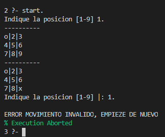

# Acertijo de Einstein y Tres en Raya <!-- omit in toc -->

[🏫 Universidad de Huelva (UHU)](http://www.uhu.es/index.php)  
📅 Curso 2019-2020  
📚 [Representación del Conocimiento](http://www.uhu.es/etsi/informacion-academica/informacion-comun-todos-los-titulos/guias-docentes/guias-docentes-2019-2020/listado-guias/guia_1920/?codigo=606010236) 

Equipo:
- 👨‍🎓 [Alejandro Bueno Mañas](https://github.com/alexbm98)
- 👨‍🎓 [José Rramón López Garrido](https://github.com/Joseram0n)

___

## Índice <!-- omit in toc -->

- [1. INTRODUCCIÓN](#1-introducción)
- [2. EINSTEIN’S RIDDLE](#2-einsteins-riddle)
  - [2.1. BREVE DESCRIPCIÓN DEL PROBLEMA](#21-breve-descripción-del-problema)
  - [2.2. CÓDIGO PROPUESTO QUE RESUELVE EL PROBLEMA](#22-código-propuesto-que-resuelve-el-problema)
  - [2.3. EJEMPLO DE FUNCIONAMIENTO](#23-ejemplo-de-funcionamiento)
- [3. TRES EN RAYA](#3-tres-en-raya)
  - [3.1. INTRODUCCIÓN AL JUEGO](#31-introducción-al-juego)
  - [3.2. OBJETIVO](#32-objetivo)
  - [3.3. ANÁLISIS DEL CÓDIGO](#33-análisis-del-código)
    - [3.4.1. DEFINICIÓN DE PREDICADOS](#341-definición-de-predicados)
    - [3.4.2. MEJORAS IMPLEMENTADAS](#342-mejoras-implementadas)
      - [3.4.3.1. Mejora Visualización](#3431-mejora-visualización)
      - [3.4.3.2. Mejora tratamiento de errores](#3432-mejora-tratamiento-de-errores)
- [4. REFERENCIAS](#4-referencias)


## 1. INTRODUCCIÓN

En este documento se analizarán los dos problemas que hemos escogido, el problema
“Einstein’s Riddle” (el acertijo de Einstein, también conocido como el acertijo de la cebra) y
el juego del tres en raya (o también conocido como “Tateti” en Argentina, Paraguay y
Uruguay).

Trataremos de explicar lo más claramente posible el código propuesto para cada problema,
de tal manera que sea entendible para la gran mayoría de usuarios.

## 2. EINSTEIN’S RIDDLE

### 2.1. BREVE DESCRIPCIÓN DEL PROBLEMA

El planteamiento es relativamente sencillo: en una calle hay cinco casas de colores distintos,
y en cada casa vive una persona de distinta nacionalidad. Los cinco dueños no tienen
precisamente muchas cosas en común: beben diversos tipos de bebida, fuman diferentes
marcas de cigarrillos, y cada uno tiene una mascota distinta a la de los demás. Dicho esto, se
tienen las siguientes pistas:

**1.** Hay cinco casas.  
**2.** El inglés vive en la casa roja.  
**3.** El español tiene un perro.  
**4.** Se bebe café en la casa verde.  
**5.** El ucraniano bebe té.  
**6.** La casa verde está inmediatamente a la derecha de la casa de color marfil.  
**7.** El fumador de Old Gold tiene caracoles.  
**8.** La marca Kools se fuma en la casa amarilla.  
**9.** Se bebe leche en la casa del centro.  
**10.** El noruego vive en la primera casa.  
**11.** El hombre que fuma Chesterfields vive al lado del hombre con un zorro.  
**12.** La marca Kools se fuma en la casa próxima a la de donde hay un caballo.  
**13.** El fumador de Lucky Strike bebe zumo de naranja.  
**14.** El japones fuma Parliaments.  
**15.** El noruego vive al lado de la casa azul.  


Con estas pistas, se plantean las siguientes preguntas:

- ¿Quién bebe agua?
- ¿Quién es el dueño de la cebra?

Las respuestas a estas dos preguntas son: Noruego y Japonés. Se pueden averiguar a través
del código que proponemos a continuación.

### 2.2. CÓDIGO PROPUESTO QUE RESUELVE EL PROBLEMA

El código que se ha propuesto para resolver esas dos cuestiones se encuentra en el
siguiente enlace:

[Enlace Archivo](https://github.com/Joseram0n/ProyectoRc2020/blob/master/Parte_Practica/Codigo/EinsteinsProblem.pl)

Una vez observado el código, pasemos a analizar los predicados más relevantes:


> ## nextto (?A, ?B, ?List)


Es verdadero cuando los elementos “A” y “B” son consecutivos, en ese orden, en la lista
“List”.

En nuestro código lo empleamos para especificar la regla 6 , de la siguiente forma:

```prolog
nextto(house(ivory, _, _, _, _), house(green, _, _, _, _),Houses)
``` 

Con esto, estaríamos especificando que la casa verde está justo a continuación de la casa de
marfil, en la lista especificada (más adelante veremos para qué utilizaremos esta lista).

```prolog
adjacent (?A, ?B, ?List) :- nextto (A, B, List); nextto (B, A, List)
```

Se ha creado para que el predicado sea verdadero si los elementos “ **A** ” y “ **B** ” son
consecutivos en la lista “ **List** ”, sin importar el orden en el que estén.

Más concretamente, se ha utilizado para especificar las reglas 11, 12 y 15, de la siguiente
manera:

```prolog
adjacent(house(_, _, _, _, chesterfields), house(_, _, fox, _, _), Houses)

adjacent(house(_, _, _, _, kools), house(_, _, horse, _, _), Houses)

adjacent(house(_, norwegian, _, _, _), house(blue, _, _, _, _), Houses)
```
```prolog
solve (-WaterDrinker, - ZebraOwner)
```
Este será el predicado que nos resolverá las dos cuestiones planteadas.

**WaterDrinker** nos indicará la nacionalidad de la persona que bebe agua, por otra parte
**ZebraOwner** nos indicará la nacionalidad de la persona que tiene una cebra como
mascota.

**_length (?List, ?Int)_**

Unifica si el número entero “ **Int** ” coincide con el tamaño de la lista “ **List** ”. Se trata de un
predicado reversible ya que podemos averiguar tanto la longitud de una lista como crear
una lista con la longitud del parámetro “ **Int** ”.

En nuestro problema, lo utilizamos en este segundo caso, para crear una lista llamada
“Houses” (la que mencionamos anteriormente) de tamaño 5.

**_length_(Houses,5)_** -> **Regla 1**

Esto se corresponde con la primera pista que detallamos en la descripción del problema,
esta es, que hay cinco casas.

**_member (?Elem, ?List)_**

Este predicado será cierto si el elemento “ **Elem** ” existe en la lista “ **List** ”.

En nuestro problema, dicho a grandes rasgos, lo usamos para añadir una estructura
representada por el predicado “house” a la lista Houses que creamos previamente.

El predicado house está modelado de la siguiente manera:

house (Color de la casa, Nacionalidad, Mascota, Bebida, Marca de cigarrillos)

Dicho lo cual, el uso del predicado **_member_** en nuestro código es el siguiente:

**_member_** _(house(red, english, _, _, _), Houses)_ **Regla 2**

**_member_** _(house(_, spanish, dog, _, _), Houses)_ **Regla 3**

**_member_** _(house(green, _, _, coffee, _), Houses)_ **Regla 4**

**_member_** _(house(_, ukrainian, _, tea, _), Houses)_ **Regla 5**

**_member_** _(house(_, _, snail, _, old_gold), Houses)_ **Regla 7**

**_member_** _(house(yellow, _, _, _, kools), Houses)_ **Regla 8**

**_member_** _(house(_, _, _, orange_juice, lucky_strike), Houses)_ **Regla 13**

**_member_** _(house(_, japanese, _, _, parliaments), Houses)_ **Regla 14**

**---------------------------------------------------**

**_member_** _(house(_, WaterDrinker, _, water, _), Houses)_ **Nos dirá quien bebe agua**

**_member_** _(house(_, ZebraOwner, zebra, _, _), Houses)_ **Nos dirá quién tiene una cebra**

___
**_nth 1 (?Index, ?List, ?Elem)_**

Es cierto si el elemento “ **Elem** ” está situado en la posición “ **Index** ” dentro de la lista
“ **List** ”.

En el contexto de nuestro problema, lo utilizamos para especificar las reglas 9 y 10:

**_nth1_** _( 3 , Houses, house(_, _, _, milk, _))_ **Regla 9**

**_nth1_** _( 1 , Houses, house(_, norwegian, _, _, _))_ **Regla 10**

Es decir, en la casa del centro se bebe leche (Regla 9) y en la primera casa vive el noruego
(Regla 10).

### 2.3. EJEMPLO DE FUNCIONAMIENTO

A continuación, una muestra del funcionamiento del código:


Como se puede observar, muestra la solución correcta. La persona que bebe agua es de
nacionalidad noruega y la persona que tiene como mascota una cebra es de nacionalidad
japonesa.


## 3. TRES EN RAYA

### 3.1. INTRODUCCIÓN AL JUEGO

El juego de tres en raya es para 2 jugadores, consiste en intentar formar una línea usando
fichas (X u O) en 3 casillas adjuntas (las diagonales cuentan) en un tablero de 3x3.

Es un juego que debido a su simplicidad se suele usar como herramienta pedagógica para
enseñar los conceptos de teoría de juegos y la rama de inteligencia artificial que se encarga
de la búsqueda de árboles de juego.

### 3.2. OBJETIVO

Se intenta crear un agente reactivo que sea capaz de reaccionar a los cambios en el sistema y jugar
siguiendo una estrategia predefinida.

### 3.3. ANÁLISIS DEL CÓDIGO

El código se puede encontrar el siguiente archivo del repositorio:

[Enlace Archivo](https://github.com/Joseram0n/ProyectoRc2020/blob/master/Parte_Practica/Codigo/tateti.pl)

Primero se le indica a prolog con la directiva dynamic que la definición de un predicado
puede cambiar durante el proceso de ejecución.

#### 3.4.1. DEFINICIÓN DE PREDICADOS

**_x(?L)_**

Es un predicado para indicar el hecho de que la posición (numero) L contiene una ficha X.

**_o(?L)_**

Es un predicado para indicar el hecho de que la posición (numero) L contiene una ficha O.

**_ocupado(?L)_**

Es cierto si L es un numero con una casilla ocupada por X u O.


**_trio(+L,+L,+L)_**

Es un predicado que se usar para indicar el trio de posición en la que se puede ganar.

**_tatetí_**

Es cierto si existe un trio y las 3 casillas son de la misma ficha.

**_lleno_**

Implementado para detectar cuando el tablero está lleno, es decir, cuando ya no se pueden
hacer más movimientos.

El predicado es cierto cuando el predicado **ocupado** es cierto para todas las casillas.

**_empate_**

Es cierto si lleno es verdadero y no hay tatetí.

**_desventaja(?L)_**

Es cierto si al jugador solo le falta una casilla para lograr tatetí.

**_ventaja(?L)_**

Es cierto si la maquina (PC) solo necesita una casilla más para lograr tatetí.

**_defender(?L)_**

Es cierto si al jugador aún le faltan dos movimientos para lograr tatetí.

**_atacar(?L)_**

Es cierto si a PC aún le faltan dos movimientos para lograr tatetí.

**_indiferente(L)_**

Es cierto cuando ninguna de las estrategias anteriores es cierta, de manera que devuelve una
posición cualquiera según un orden de prioridad preestablecido.


**_movimiento_pc_**

Movimiento realizado por la máquina. Hace uso de los predicados **_lugar_elegido_** y **_assert_**.

**_lugar_elegido (+L)_**

Predicado que aplica las estrategias _ventaja_ , _desventaja_ , _defender_ , _atacar_ e _indiferente_.

Las ejecuta en ese orden de prioridad, si no es posible ejecutar una, pasa a la siguiente en
prioridad.

**_limpiar_**

Como su propio nombre indica, borra el tablero del juego.

**_lugar_valido (+L)_**

Es cierto cuando la posición que queremos utilizar (L) está comprendida en el rango de 1 a
9 y no ha sido utilizada previamente.

**_movimiento_humano_**

Solicita al usuario que introduzca la posición en la que quiere colocar su ficha. A
continuación, lee la posición introducida y comprueba que la posición es válida a través del
predicado **_lugar_valido_**. Si este último predicado es cierto, confirma la operación y coloca
la ficha del usuario en la posición indicada por el mismo.

**_imp_L (?L)_**

Dibuja una determinada ficha en la posición **_L_**.

**_imp_tablero_**

Dibuja el tablero con la jugada del jugador y a continuación con la de la máquina.


Para ello se ha utilizado un predicado **_separador_** (que imprime una serie de guiones) junto
con el predicado **_imp_L_** para imprimir en cada casilla su correspondiente posición, de tal
manera que el jugador sepa el sistema de posiciones utilizadas en el juego.

**_write(+X)_**

Imprime en pantalla los caracteres contenidos en **_X_**.

**_nl_**

Escribe una nueva línea de caracteres al buffer de salida actual. En otras palabras, ejecuta un
salto de línea.

**_fin_**

Es cierto cuando se ha producido un tres en raya ya sea por parte de la máquina o por parte
del usuario. Esto lo comprueba a través del predicado **_tateti_**. Si se cumple, imprime que se
ha logrado hacer Tateti. Si no se cumpliera comprobaría que se producido un empate a
través del predicado **_empate_** , en tal caso imprimiría que se ha alcanzado un empate.

**_start_**

Predicado principal para iniciar una partida, este predicado llama a **limpiar** para borrar
datos de una partida anterior y a continuación llama a **jugar_humano** para que empiece el
jugador la nueva partida.

**_start_pc_**

Predicado exactamente igual al anterior con la única diferencia que llama a **_jugar_pc_** en
lugar de **_jugar_humano._**

**_jugar_humano_**

Predicado para jugar la partida con el siguiente orden: humano -> maquina.

**_jugar_pc_**

Predicado para jugar la partida con el siguiente orden: maquina -> humano.


#### 3.4.2. MEJORAS IMPLEMENTADAS

Hemos decidido hacerle una pequeña mejora al código para mejorar la visualización de la partida por
pantalla y tratar los errores de input del usuario, modificando el predicado **imp_tablero** y
**lugar_valido**.

##### 3.4.3.1. Mejora Visualización

___
##### 3.4.3.2. Mejora tratamiento de errores


## 4. REFERENCIAS

[📖 Manual de Prolog](https://www.swi-prolog.org/pldoc/doc_for?object=manual)

[🧾 Proyecto Representación del Conocimiento jcarpio](https://github.com/jcarpio/rc1920/blob/master/proyecto-rc.md)

[👨‍🏫 Pagina UHU Profesor](http://www.uhu.es/jose.carpio/)